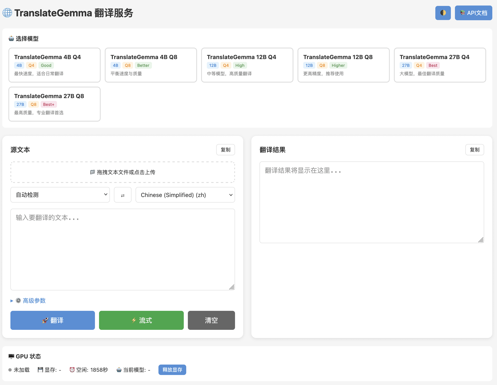

[English](README.md) | [简体中文](README_CN.md) | [繁體中文](README_TW.md) | [日本語](README_JP.md)

# TranslateGemma

> 🌍 Local AI Translation Service with Web UI, REST API & MCP Integration  
> 55 languages, smart chunking, streaming output. Powered by Google's TranslateGemma.

[](https://hub.docker.com/r/neosun/translategemma)
[](https://www.python.org/)
[](LICENSE)
[](https://developer.nvidia.com/cuda-toolkit)

---

## ✨ Highlights

- 🌐 **Web UI** - Beautiful, responsive translation interface
- 🔌 **REST API** - Full-featured API with streaming support
- 🤖 **MCP Integration** - Works with Claude Desktop & AI assistants
- 🌍 **55 Languages** - Full TranslateGemma language support
- 📚 **Smart Chunking** - Handle unlimited text length (chunk_size=100)
- ⚡ **Streaming Output** - Real-time translation progress
- 🐳 **All-in-One Docker** - 82GB image with all 6 models embedded
- 🎯 **Multi-Model** - 4B/12B/27B with Q4/Q8 quantization

---

## 🎬 Quick Start

### Option 1: Docker All-in-One (Recommended)

```bash
# Pull the all-in-one image (82GB, includes all models)
docker pull neosun/translategemma:v1.0.0-allinone

# Run with GPU
docker run -d --gpus '"device=0"' \
  -p 8022:8022 \
  -e MODEL_NAME=27b \
  -e QUANTIZATION=8 \
  --name translategemma \
  neosun/translategemma:v1.0.0-allinone

# Access Web UI
open http://localhost:8022
```

### Option 2: Docker with Model Download

```bash
# Pull lightweight image (10GB)
docker pull neosun/translategemma:latest

# Run (models download on first use)
docker run -d --gpus '"device=0"' \
  -p 8022:8022 \
  -v ~/.cache/translate/models:/root/.cache/translate/models \
  --name translategemma \
  neosun/translategemma:latest
```

### Option 3: Docker Compose

```yaml
# docker-compose.yml
services:
  translategemma:
    image: neosun/translategemma:v1.0.0-allinone
    container_name: translategemma
    ports:
      - "8022:8022"
    environment:
      - NVIDIA_VISIBLE_DEVICES=0
      - MODEL_NAME=27b
      - QUANTIZATION=8
      - BACKEND=gguf
      - GPU_IDLE_TIMEOUT=0
      - MAX_CHUNK_LENGTH=100
    deploy:
      resources:
        reservations:
          devices:
            - driver: nvidia
              device_ids: ["0"]
              capabilities: [gpu]
```

```bash
docker-compose up -d
```

---

## 🖥️ Web UI

Access the beautiful web interface at `http://localhost:8022`:



**Features:**
- 🎨 Dark/Light theme toggle
- 🔄 Language swap button
- 📊 Real-time translation stats
- ⚙️ Advanced parameter controls
- 📁 File upload support
- 🔥 GPU status monitoring

---

## 🔌 REST API

### Translate Text

```bash
# Simple translation
curl -X POST http://localhost:8022/translate \
  -H "Content-Type: application/json" \
  -d '{"text": "Hello world", "target_lang": "zh"}'

# Response
{
  "translation": "你好，世界",
  "source_lang": "en",
  "target_lang": "zh",
  "model": "27b-Q8",
  "time_ms": 1234
}
```

### Streaming Translation

```bash
curl -X POST http://localhost:8022/translate/stream \
  -H "Content-Type: application/json" \
  -d '{"text": "Long text here...", "target_lang": "zh"}'
```

### API Endpoints

| Endpoint | Method | Description |
|----------|--------|-------------|
| `/translate` | POST | Translate text |
| `/translate/stream` | POST | Streaming translation |
| `/config` | GET | Get current config |
| `/models` | GET | List available models |
| `/languages` | GET | List supported languages |
| `/gpu/status` | GET | GPU memory status |
| `/health` | GET | Health check |

---

## ⚙️ Configuration

### Environment Variables

| Variable | Default | Description |
|----------|---------|-------------|
| `MODEL_NAME` | `27b` | Model size: 4b, 12b, 27b |
| `QUANTIZATION` | `8` | Quantization: 4 or 8 |
| `BACKEND` | `gguf` | Backend: gguf, pytorch |
| `GPU_IDLE_TIMEOUT` | `0` | Auto-unload timeout (0=immediate) |
| `MAX_CHUNK_LENGTH` | `100` | Safe chunk size for completeness |
| `DEFAULT_OVERLAP` | `0` | Sliding window overlap (0=disabled) |
| `NVIDIA_VISIBLE_DEVICES` | `0` | GPU device ID |

### Model Selection Guide

| Model | VRAM | Quality | Speed | Use Case |
|-------|------|---------|-------|----------|
| 4B-Q4 | ~3GB | Good | Fast | Quick translations |
| 4B-Q8 | ~5GB | Better | Fast | Daily use |
| 12B-Q4 | ~7GB | High | Medium | Balanced |
| 12B-Q8 | ~12GB | Higher | Medium | Recommended |
| 27B-Q4 | ~15GB | Best | Slow | High quality |
| **27B-Q8** | ~28GB | **Best+** | Slow | **Professional** ⭐ |

---

## 🌍 Supported Languages (55)

| Code | Language | Code | Language | Code | Language |
|------|----------|------|----------|------|----------|
| `en` | English | `zh` | Chinese (Simplified) | `zh-TW` | Chinese (Traditional) |
| `ja` | Japanese | `ko` | Korean | `yue` | Cantonese |
| `fr` | French | `de` | German | `es` | Spanish |
| `pt` | Portuguese | `ru` | Russian | `ar` | Arabic |
| `hi` | Hindi | `th` | Thai | `vi` | Vietnamese |

...and 40 more languages. See `/languages` endpoint for full list.

---

## 🐳 Docker Images

| Image | Size | Description |
|-------|------|-------------|
| `neosun/translategemma:v1.0.0-allinone` | 82GB | All 6 models embedded |
| `neosun/translategemma:latest-allinone` | 82GB | Latest all-in-one |
| `neosun/translategemma:v1.0.0` | 10GB | Lightweight, download models |
| `neosun/translategemma:latest` | 10GB | Latest lightweight |

---

## 📊 Technical Details

### Smart Chunking

TranslateGemma truncates long texts. Our smart chunking ensures complete translations:

```
chunk_size=100  →  100% translation completeness
chunk_size=120  →  44% completeness (truncation)
chunk_size=150  →  44% completeness (truncation)
```

**Key Finding**: `chunk_size=100` is the safe boundary for complete translations.

### Context Consistency

TranslateGemma automatically maintains consistency across chunks:
- ✅ Pronouns (He/She/They)
- ✅ Terminology (NLP, AI)
- ✅ Proper nouns (Google, Microsoft)
- ✅ Gender consistency

No overlap needed for context preservation.

---

## 🛠️ Local Development

### Prerequisites

- Python 3.11+
- NVIDIA GPU with CUDA 12.4+
- 16GB+ VRAM (for 27B model)

### Installation

```bash
# Clone repository
git clone https://github.com/neosun100/translategemma.git
cd translategemma

# Create virtual environment
python -m venv .venv
source .venv/bin/activate

# Install dependencies
pip install -e ".[cuda]"

# Run server
uvicorn app_fastapi:app --host 0.0.0.0 --port 8022
```

---

## 🤖 MCP Integration

Use with Claude Desktop or other MCP-compatible AI assistants:

```json
{
  "mcpServers": {
    "translategemma": {
      "command": "python",
      "args": ["mcp_server.py"],
      "env": {
        "TRANSLATEGEMMA_URL": "http://localhost:8022"
      }
    }
  }
}
```

---

## 📁 Project Structure

```
translategemma/
├── app_fastapi.py          # FastAPI server
├── mcp_server.py           # MCP server
├── templates/
│   └── index.html          # Web UI
├── static/
│   ├── app.js              # Frontend JS
│   └── style.css           # Styles
├── translategemma_cli/     # Core library
│   ├── translator.py       # Translation logic
│   ├── chunker.py          # Text chunking
│   ├── model.py            # Model loading
│   └── config.py           # Configuration
├── Dockerfile              # Standard image
├── Dockerfile.allinone     # All-in-one image
├── docker-compose.yml      # Compose config
└── tests/                  # Test suite
```

---

## 🔬 Research Findings

Our extensive testing revealed:

| Parameter | Optimal Value | Reason |
|-----------|---------------|--------|
| chunk_size | 100 | 100% translation completeness |
| overlap | 0 | TranslateGemma auto-maintains context |
| quantization | Q8 | Best quality/speed balance |

See [CHUNKING_RESEARCH_REPORT.md](docs/CHUNKING_RESEARCH_REPORT.md) for details.

---

## 📄 License

MIT License - see [LICENSE](LICENSE) file.

**Note**: TranslateGemma models are subject to [Google's model license](https://ai.google.dev/gemma/terms).

---

## 🙏 Acknowledgments

- [Google TranslateGemma](https://huggingface.co/collections/google/translategemma) - Base translation model
- [llama-cpp-python](https://github.com/abetlen/llama-cpp-python) - GGUF inference
- [FastAPI](https://fastapi.tiangolo.com/) - Web framework

---

## ⭐ Star History

[](https://star-history.com/#neosun100/translategemma)

## 📱 关注公众号


